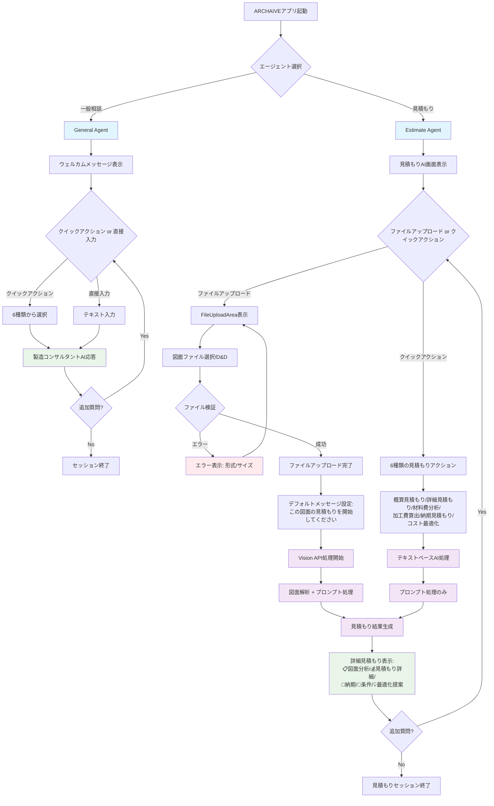
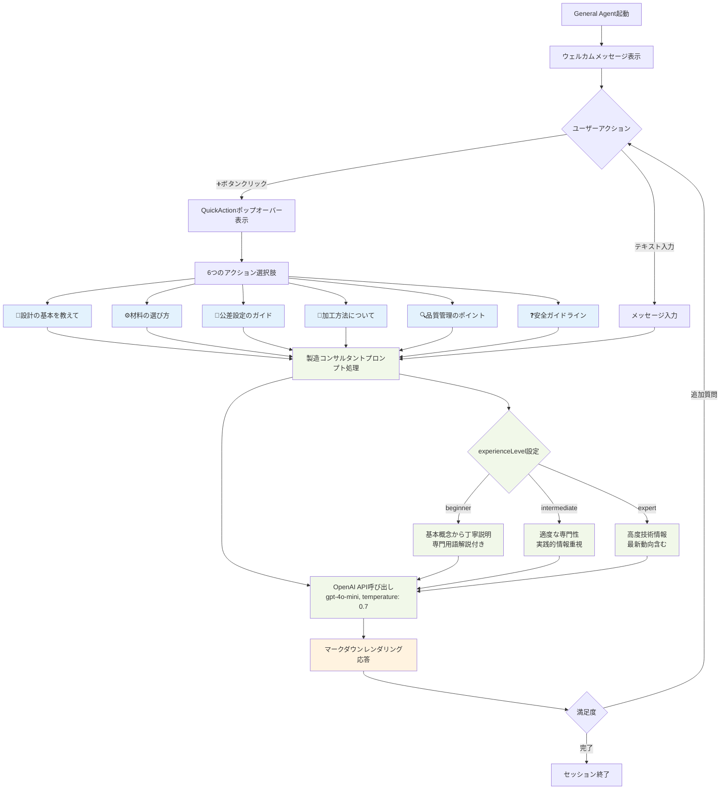
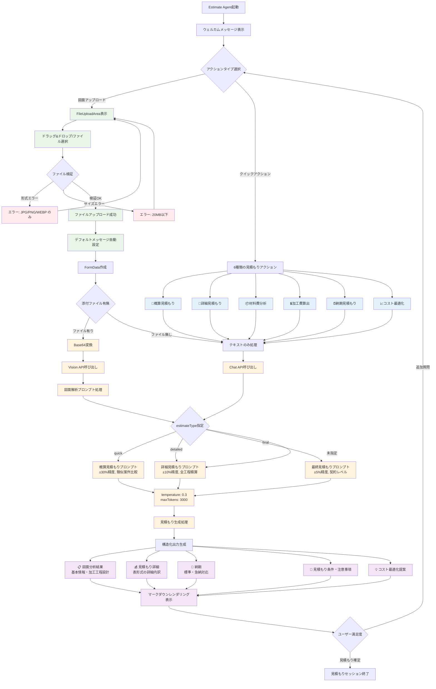
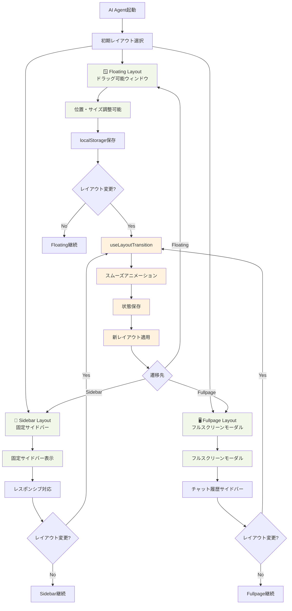

# 05plus-ユーザージャーニー図（Mermaid）

## 見積もりエージェントの種類について

コード分析の結果、見積もりエージェントには **3つの見積もりタイプ** が設定されていることがわかりました：

### 見積もりタイプ（EstimateType）

1. **`quick`** - 概算見積もり（±30%精度、速度重視）
2. **`detailed`** - 詳細見積もり（±10%精度、全工程積算）
3. **`final`** - 最終見積もり（±5%精度、契約レベル）

これらの設定は `src/app/api/ai-agents/shared/types.ts:83` および `validation.ts:43` で定義されており、APIリクエスト時のメタデータで指定可能です。

## 全体ユーザージャーニー



## General Agent 詳細ジャーニー



## Estimate Agent 詳細ジャーニー



## メタデータフロー詳細

```mermaid
graph TD
    A[API Request] --> B{Agent Type}

    %% General Agent Metadata
    B -->|general| C[GeneralMetadata]
    C --> C1[sessionId: string?]
    C --> C2[userId: string?]
    C --> C3[preferences]
    C3 --> C3a[experienceLevel: beginner/intermediate/expert]
    C3 --> C3b[preferredUnits: metric/imperial]
    C3 --> C3c[industryFocus: string[]]

    %% Estimate Agent Metadata
    B -->|estimate| D[EstimateMetadata]
    D --> D1[blueprintInfo]
    D1 --> D1a[id, name, material]
    D1 --> D1b[customerName, productName]

    D --> D2[estimateType: quick/detailed/final]
    D --> D3[quantity: number]
    D --> D4[deliveryRequirement]
    D4 --> D4a[deadline: Date]
    D4 --> D4b[priority: normal/urgent/flexible]

    D --> D5[qualityRequirements]
    D5 --> D5a[tolerance: string]
    D5 --> D5b[surfaceFinish: string]
    D5 --> D5c[inspection: string[]]

    %% Processing
    C --> E[JSON Request Body]
    D --> F[FormData Request]
    F --> F1[message: string]
    F --> F2[metadata: JSON string]
    F --> F3[image: File?]

    E --> G[validateGeneralRequest]
    F --> H[validateEstimateRequest]

    G --> I[General Agent Processing]
    H --> J[Estimate Agent Processing]

    classDef metaBox fill:#e1f5fe
    classDef processBox fill:#e8f5e8

    class C,C1,C2,C3,D,D1,D2,D3,D4,D5 metaBox
    class G,H,I,J processBox
```

## レイアウト遷移ジャーニー



## まとめ

このユーザージャーニー図から分かる重要なポイント：

1. **見積もりタイプは3段階** - quick/detailed/final で精度と用途が異なる
2. **ファイルアップロード機能** - Vision APIによる図面解析が核心機能
3. **クイックアクション** - 各エージェント6つずつの専門アクション
4. **レイアウト柔軟性** - 3つのレイアウトでユーザー環境に適応
5. **メタデータ活用** - ユーザー設定やプロジェクト情報で回答をカスタマイズ

これらの機能により、製造業の多様なニーズに対応できる包括的なAIエージェントシステムを実現しています。
