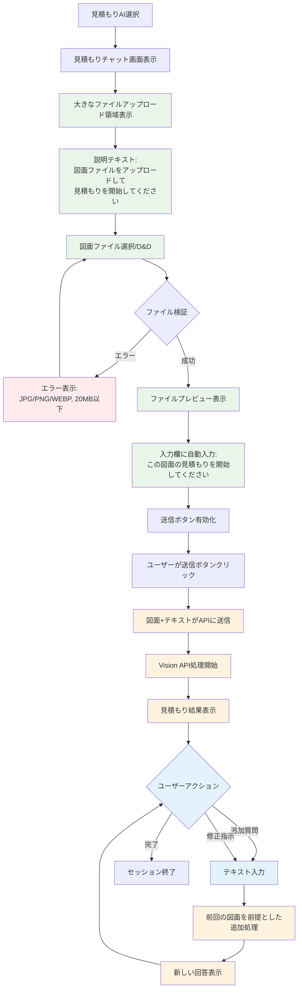
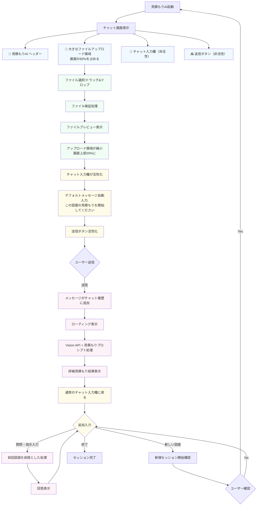

# 05-02-シンプル化された見積もりエージェント ユーザージャーニー

## コンセプト：ChatGPTライクなシンプルな図面見積もり体験

一般的なAIチャット（ChatGPT等）と同じような直感的な操作で、図面見積もりに特化した体験を提供します。

### 設計思想

- **クイックアクション不要** - 複雑な選択肢を排除
- **1クリック見積もり開始** - 図面アップロード→デフォルトメッセージ→送信の3ステップ
- **継続対話型** - 初回の図面を前提とした追加質問・修正指示が可能
- **ChatGPTライクUX** - 使い慣れたチャットインターフェース

## シンプル化されたユーザージャーニー



## 詳細UXフロー



## 技術実装の変更点

### 1. agentConfigs.ts の簡素化

```typescript
estimate: {
  id: 'estimate',
  name: '見積もりAI',
  icon: Calculator,
  description: '図面から見積もりを自動生成',
  color: '#10b981',
  category: AgentCategory.ESTIMATE,
  welcomeMessage: '図面ファイルをアップロードして見積もりを開始してください',
  defaultInput: 'この図面の見積もりを開始してください',
  quickActions: [] // クイックアクション削除
}
```

### 2. EstimateChatContent.tsx の UI変更

```typescript
// 初期状態：大きなファイルアップロード領域
const InitialUploadView = () => (
  <div className="flex-1 flex flex-col items-center justify-center p-8">
    <div className="w-full max-w-2xl">
      <h2 className="text-2xl font-bold text-center mb-2">見積もりAI</h2>
      <p className="text-center text-muted-foreground mb-8">
        図面ファイルをアップロードして見積もりを開始してください
      </p>
      <FileUploadArea
        onFileUpload={handleFileUpload}
        acceptedTypes={['.jpg', '.jpeg', '.png', '.webp']}
        maxSize={20 * 1024 * 1024}
        className="h-64" // 大きなアップロード領域
      />
    </div>
  </div>
);

// ファイルアップロード後：縮小されたプレビュー＋チャット
const ChatWithPreview = () => (
  <div className="flex-1 flex flex-col">
    {/* 縮小されたファイルプレビュー */}
    <div className="border-b p-4 bg-muted/30">
      <div className="flex items-center gap-3">
        <FileImage className="w-6 h-6" />
        <span className="text-sm font-medium">{uploadedFile.name}</span>
        <Button variant="ghost" size="sm" onClick={handleRemoveFile}>
          <X className="w-4 h-4" />
        </Button>
      </div>
    </div>

    {/* チャット履歴 */}
    <div className="flex-1 overflow-y-auto p-4">
      {messages.map((message) => (
        <ChatMessage key={message.id} message={message} />
      ))}
    </div>
  </div>
);
```

### 3. バックエンド処理の簡素化

```typescript
// estimateType の自動判定（ユーザーは選択不要）
private determineEstimateType(message: string): 'quick' | 'detailed' {
  // シンプルなキーワード判定
  const detailKeywords = ['詳細', '精密', '正確', '契約'];
  const hasDetailKeyword = detailKeywords.some(keyword =>
    message.includes(keyword)
  );

  return hasDetailKeyword ? 'detailed' : 'quick';
}

// システムプロンプトの簡素化
private buildSystemPrompt(): string {
  return `
あなたは製造業の見積もり専門AIです。
アップロードされた図面を分析し、製造見積もりを作成してください。

## 出力形式
### 📋 図面分析
- 部品概要、主要寸法、推定材質

### 💰 見積もり
| 項目 | 単価 | 数量 | 金額 | 備考 |
|------|------|------|------|------|
| 材料費 | ¥X/kg | Xkg | ¥X | XX材、切りしろ含む |
| 加工費 | ¥X/時間 | X時間 | ¥X | XX加工、段取り含む |
| 合計 | - | - | ¥X | 税抜・1個あたり |

### 📅 納期
標準納期：X営業日

### 💡 最適化提案
- コスト削減案があれば提示

必ず日本語で、表形式を使って見やすく回答してください。
`;
}
```

## ユーザーエクスペリエンス比較

### Before（複雑）

1. エージェント選択
2. 6つのクイックアクションから選択
3. ファイルアップロード
4. 見積もりタイプ選択
5. メタデータ入力
6. 送信

### After（シンプル）

1. 見積もりAI選択
2. 図面ファイルアップロード
3. 送信ボタンクリック
4. 結果確認
5. 必要に応じて追加質問

## 期待される効果

### UX改善

- **学習コストゼロ** - ChatGPTユーザーなら即座に理解
- **操作ステップ削減** - 6ステップ→3ステップ
- **判断疲れ解消** - 選択肢を最小限に

### 技術的メリット

- **コード簡素化** - クイックアクション関連のロジック削除
- **保守性向上** - UI状態管理の単純化
- **エラー要因削減** - 複雑な分岐処理の削除

### ビジネス価値

- **導入障壁低下** - 直感的な操作で利用開始
- **利用頻度向上** - 手軽さによる再利用促進
- **満足度向上** - ストレスフリーな操作体験

この簡素化により、見積もりAIの本質的価値である「図面から迅速な見積もり生成」に集中でき、ユーザーにとってより使いやすいツールになります。
