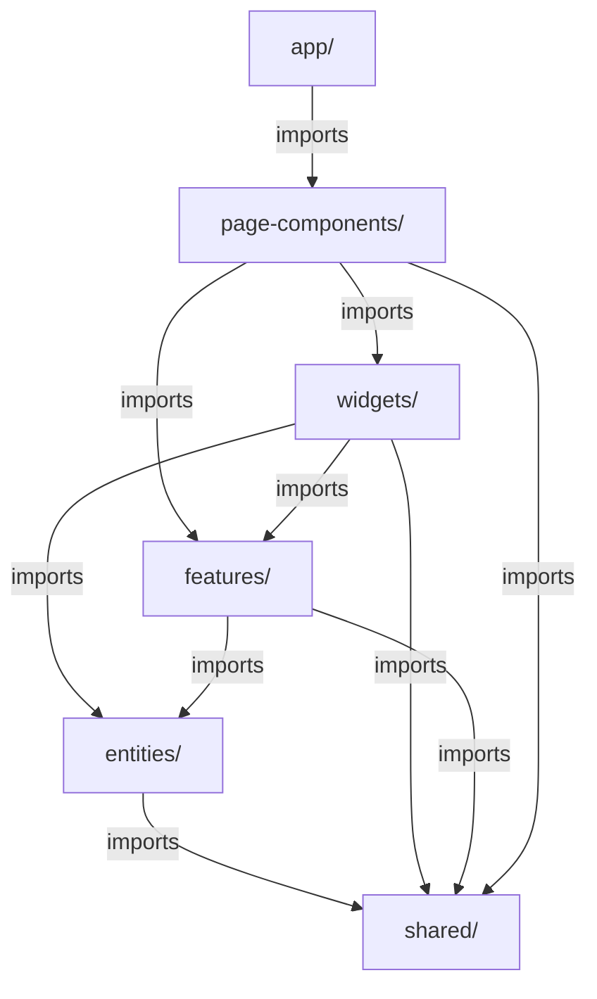

# FSD と Next.js App Router の統合

## 概要
FSD（Feature-Sliced Design）とNext.js 15のApp Routerを統合する際の実装パターンとベストプラクティスを示します。

## ディレクトリ構造の統合

### Next.js App Router構造とFSDの共存

```
frontend/
├── app/                          # Next.js App Router（ルーティング層）
│   ├── (master)/                 # マスター管理グループ
│   │   ├── item-master/
│   │   │   └── page.tsx
│   │   ├── store-master/
│   │   │   └── page.tsx
│   │   ├── warehouse-master/
│   │   │   └── page.tsx
│   │   └── maker-master/
│   │       └── page.tsx
│   ├── (order)/                  # 発注グループ
│   │   ├── order-list/
│   │   │   └── page.tsx
│   │   ├── order-creation/
│   │   │   └── page.tsx
│   │   ├── order-selection/
│   │   │   └── page.tsx
│   │   ├── order-application/
│   │   │   └── page.tsx
│   │   └── update-order-list/
│   │       └── page.tsx
│   ├── (bi)/                     # BI分析グループ
│   │   ├── store-analysis/
│   │   │   └── page.tsx
│   │   └── new-item-analysis/
│   │       └── page.tsx
│   ├── layout.tsx               # Root Layout
│   ├── page.tsx                 # Home Page (Login)
│   └── globals.css
│
└── src/                         # FSD構造
    ├── app/                     # アプリケーション設定（providers）
    ├── page-components/         # ページ統合層
    ├── widgets/                 # 複合UIコンポーネント層
    ├── features/                # 機能固有の実装層
    ├── entities/                # ビジネスエンティティ層
    └── shared/                  # 共有リソース層
```

## FSDレイヤーの責務分担

### app/ (Next.js App Router)
- **責務**: ルーティング、メタデータ、レイアウト定義
- **含むもの**: page.tsx, layout.tsx, loading.tsx, error.tsx
- **含まないもの**: ビジネスロジック、状態管理、UIコンポーネント

### src/app/ (FSD Application Layer)
- **責務**: グローバルな設定とプロバイダー
- **含むもの**: providers/, store/, styles/
- **含まないもの**: ページ固有のロジック

### src/page-components/
- **責務**: ページ固有の状態管理とオーケストレーション
- **含むもの**: 
  - ページコンテナコンポーネント
  - ページ固有のカスタムフック
  - ページレベルの状態管理
- **含まないもの**: 再利用可能なUIコンポーネント

### src/widgets/
- **責務**: 複数のfeatureを組み合わせた大きなUIブロック
- **含むもの**: サイドバー、商品一覧テーブル、商品フィルター、店舗テーブルなど
- **含まないもの**: ページ固有のロジック、他のwidgets（同一レイヤー依存禁止）
- **設計原則**: 
  - **Props駆動型**: 外部から動作を制御可能な設計
  - **ロジック分離**: UIロジックはカスタムフックに分離
  - **再利用性重視**: 複数のページで使用可能な汎用的な設計

### src/features/
- **責務**: 独立した機能単位のコンポーネント
- **含むもの**: 機能に必要なUI、ロジック、API呼び出し
- **含まないもの**: ページ全体の状態管理

### src/entities/
- **責務**: ビジネスエンティティの定義とAPI
- **含むもの**: 型定義、APIクライアント、Redux状態管理、エンティティ固有のフック
- **含まないもの**: 複雑なUIコンポーネント
- **現状**: item、store-order、warehouse-order、stock、sale、user、store、warehouse、maker、analyticsエンティティを実装

### src/shared/
- **責務**: アプリケーション全体で共有されるリソース
- **含むもの**: shadcn/uiコンポーネント、APIクライアント、MSWハンドラー、ユーティリティ、設定
- **含まないもの**: ビジネスロジック

## ディレクトリ構造の例

### page-componentsレイヤーを使用した構成

```
src/
├── app/                          # グローバル設定
│   ├── providers/
│   └── styles/
├── page-components/              # ページ固有のコンポーネント
│   ├── item-master/
│   │   ├── ui/
│   │   │   └── ItemMasterPageContainer.tsx
│   │   ├── model/
│   │   │   └── useItemMasterPage.ts
│   │   └── index.ts
│   ├── orders/
│   │   ├── list/
│   │   ├── create/
│   │   └── detail/
│   └── ...
├── widgets/                      # 大きなUIブロック
│   ├── sidebar/               # サイドバー（ロジック分離済み）
│   │   ├── ui/Sidebar.tsx
│   │   └── lib/useSidebar.ts
│   ├── item-table/            # 商品テーブル（featuresから移動）
│   │   ├── ui/ItemMasterTable.tsx
│   │   └── lib/useItemTable.ts
│   ├── item-filter/           # 商品フィルター
│   ├── export-button/         # エクスポートボタン
│   └── analytics-dashboard/   # 分析ダッシュボード
├── features/                     # 独立した機能
│   ├── auth/                  # 認証機能（完成）
│   ├── item-edit/             # 商品編集（完成）
│   ├── item-filtering/        # 商品フィルタリング（完成）
│   ├── item-selection/        # 商品選択（完成）
│   ├── item-settings/         # 商品表示設定（完成）
│   ├── order-creation/        # 発注作成（骨格のみ）
│   ├── order-list/            # 発注一覧（骨格のみ）
│   ├── maker-master/          # メーカーマスター（骨格のみ）
│   ├── store-master/          # 店舗マスター（骨格のみ）
│   ├── warehouse-master/      # 倉庫マスター（骨格のみ）
│   ├── store-analysis/        # 店舗分析（骨格のみ）
│   ├── new-item-analysis/     # 新商品分析（骨格のみ）
│   └── analytics-filter/      # 分析フィルター（骨格のみ）
│   # 移動完了
│   # item-data/ → page-components/item-master/に移動
│   # item-table/ → widgets/item-table/に移動
│   # data-export/ → page-components/item-master/に移動
├── entities/
│   ├── item/                  # 商品エンティティ（完成）
│   │   ├── api/               # APIクライアント
│   │   ├── model/             # 型定義、Redux状態管理
│   │   └── ui/                # エンティティの基本UI
│   ├── order/                 # 発注エンティティ（統合型、骨格のみ）
│   ├── stock/                 # 在庫エンティティ（骨格のみ）
│   ├── sale/                  # 売上エンティティ（骨格のみ）
│   ├── user/                  # ユーザーエンティティ（完成）
│   ├── store/                 # 店舗エンティティ（骨格のみ）
│   ├── warehouse/             # 倉庫エンティティ（骨格のみ）
│   ├── maker/                 # メーカーエンティティ（骨格のみ）
│   └── analytics/             # 分析エンティティ（骨格のみ）
└── shared/
    ├── ui/                    # shadcn/uiコンポーネント
    ├── api/                   # APIクライアント・MSWハンドラー
    ├── lib/                   # ユーティリティ関数
    └── config/                # 設定ファイル
```

### 各レイヤーのインポートルール



**重要な制約事項：**
- **同一レイヤー間の依存禁止**: widgets間、features間、entities間での相互参照は禁止
- **上位レイヤーへの依存禁止**: 下位レイヤーから上位レイヤーへの参照は禁止
- **ESLintによる強制**: FSD boundaries ルールにより自動的にチェック

## まとめ

FSDとNext.js App Routerの統合におけるポイント：

1. **app/ディレクトリはルーティング専用**: page.tsxとプロバイダーのみ
2. **page-components/でページ状態管理**: ページ全体のロジックを管理
3. **features/は独立性を保つ**: ページ状態を含まない、features間の依存禁止
4. **entities/でRedux状態管理**: ビジネスエンティティとグローバル状態
5. **shared/でインフラ層**: UI、API、MSW、ユーティリティの統合管理
6. **依存関係の厳守**: 上位レイヤーから下位レイヤーへの一方向、同一レイヤー間の依存禁止
7. **Public APIの最小化**: 必要最小限のエクスポート
8. **Widgets設計原則**: Props駆動型、ロジック分離（カスタムフック）、再利用性重視
9. **共通コンポーネントの積極活用**: ExportButtonなどの汎用コンポーネントはshared/uiに配置

### 実装状況
- **完成済み**: 認証機能、商品マスター機能（item-edit, item-filtering, item-selection, item-settings）
- **リファクタリング完了**: 商品テーブル（widgetsに移動）、商品データ管理（page-componentsに移動）、エクスポート機能（page-componentsに移動）
- **部分実装**: 発注機能（order-creation, order-list等）、各種マスター機能（store-master, warehouse-master, maker-master）、分析機能（store-analysis, new-item-analysis）
- **今後の課題**: 他マスター機能、BI分析機能の完全実装、継続的なFSD最適化

これらのパターンを活用し、実際のビジネス要件に基づいた実装を段階的に進めることで、スケーラブルで保守性の高いNext.jsアプリケーションを構築できます。