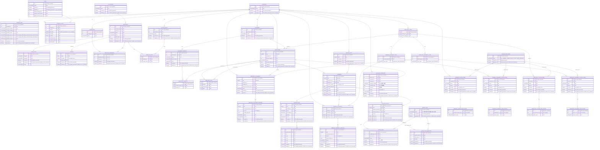

```mermaid
erDiagram
    COMPANIES {
        int id PK "NN, auto_increment"
        varchar(255) name "NN"
        datetime created_at "NN, default_generated"
        datetime updated_at "NN, default_generated on current_timestamp"
    }

    COMPANY_INFO {
        int id PK "NN, auto_increment"
        int company_id FK "NN"
        varchar(255) company_address1 "NN"
        varchar(255) company_address2
        varchar(255) company_phone "NN"
        varchar(255) company_logo_url "NN, {company_id}/company_assets/company_logo.[extension]"
        varchar(255) company_seal_url "NN, {comapny_id}/company_assets/company_seal.[extension]"
        varchar(255) quotation_remarks "NN"
        datetime created_at "NN, default_generated"
        datetime updated_at "NN, default_generated on update current_timestamp"
    }

    COMPANY_PLANS {
        int id PK "NN auto_increment"
        int company_id FK "NN"
        int plan_id FK "NN"
        datetime start_date "NN default_generated on current_timestamp"
        datetime end_date "NN"
        boolean is_active "NN"
        int included_editors "NN"
        int included_viewers "NN"
        int drawing_limit "NN"
    }

    PLANS {
        int id PK "NN auto_increment"
        varchar(255) name "NN"
        datetime created_at "NN default_generated"
        datetime updated_at "NN default_generated on current_timestamp"
        int default_drawing_limit "NN"
        int default_included_editors "NN"
        int default_included_viewers "NN"
    }

    DEPARTMENTS {
        int id PK "NN, auto_increment"
        int company_id FK "NN"
        varchar(255) name "NN"
    }

    EMPLOYEES {
        int id PK "NN, auto_increment"
        int company_id FK "NN"
        int authority_id FK "NN"
        varchar(255) name "NN"
        varchar(255) email  "UK1"
        int initial_login "NN"
        datetime created_at "NN, default_generated"
        datetime updated_at "NN, default_generated on update current_timestamp"
    }

    LOGIN_INFOS {
        int id PK "NN, auto_increment"
        varchar(255) login_id "NN"
        varchar(255) password "NN"
        datetime created_at "NN, default_generated"
        datetime updated_at "NN, default_generated on update current_timestamp"
        varchar(1024) token
    }

    AUTHORITIES {
        int id PK "NN, auto_increment"
        varchar(255) name "NN"
        datetime created_at "NN, default_generated"
        datetime updated_at "NN, default_generated on update current_timestamp"
    }

    POLICIES {
        int id PK "NN, auto_increment"
        jsonb policy "NN"
        boolean is_active "NN, default = true"
        int created_by FK
        datetime created_at "NN, default_generated"
        datetime updated_at "NN, default_generated on update current_timestamp"
    }

    EMPLOYEE_DEPARTMENT {
        int id PK "NN, auto_increment"
        int department_id FK "NN, UK1"
        int employee_id FK "NN, UK1"
        datetime created_at "NN, default_generated"
        datetime updated_at "NN, default_generated on update current_timestamp"
    }

    CUSTOM_ROLES {
        int id PK "NN, auto_increment"
        int company_id FK "NN"
        varchar(255) name "NN"
        datetime created_at "NN, default_generated"
        datetime updated_at "NN, default_generated on update current_timestamp"
    }

    EMPLOYEE_ROLE {
        int id PK "NN, auto_increment"
        int employee_id FK "NN"
        int custom_role_id FK "NN"
    }

    CUSTOMERS {
        int id PK "NN, auto_increment"
        int company_id FK "NN"
        varchar(255) name "NN"
        datetime created_at "NN, default_generated"
        datetime updated_at "NN, default_generated on update current_timestamp"
    }

    CUSTOMER_CONTACTS {
        int id PK "NN, auto_increment"
        int customer_id FK "NN"
        varchar(255) name "NN"
        varchar(255) phone_number
        varchar(255) email
        datetime created_at "NN, default_generated"
        datetime updated_at "NN, default_generated on update current_timestamp"
    }

    DIRECTORY_CONTACTS {
        int id PK "NN, auto_increment"
        int customer_contact_id FK "NN"
        int directory_id FK "NN"
    }

    DIRECTORIES {
        int id PK "NN, auto_increment"
        char(26) ulid "NN, UK1"
        int company_id FK "NN"
        int directory_type_id "NN"
        varchar(255) name "NN"
        jsonb custome_field_item "NN"
        datetime created_at "NN, default_generated"
        datetime update_at "NN, default_generated on update current_timestamp"
    }

    DIRECTORY_PATH {
        int id PK "NN, auto_increment"
        int ancestor FK "NN"
        int descendant FK "NN"
        int depth "NN"
    }

    DIRECTORY_TYPES {
        int id PK "NN, auto_increment"
        int company_id FK "NN"
        int directory_type FK "NN"
    }

    DIRECTORY_DOCUMENTS {
        int id PK "NN, auto_increment"
        char(26) ulid "NN, UK1"
        int directory_id FK
        int company_id FK "NN"
        int directory_document_type_id FK "NN"
        varchar(255) name "NN"
        datetime created_at "NN, default_generated"
        datetime update_at "NN, default_generated on update current_timestamp"
    }

    DIRECTORY_DOCUMENT_VERSIONS {
        int id PK "NN, auto_increment"
        char(26) ulid "NN"
        int directory_document_id FK "NN"
        int version "NN, default = 1"
        jsonb custom_field_item
        varchar(255) name "NN"
        varchar(2083) s3_url "NN"
        datetime created_at "NN, default_generated"
        datetime updated_at "NN, default_generated on update current_timestamp"
    }

    SUPPLIER_QUOTATIONS {
        int id PK "NN, auto_increment"
        int directory_id FK "NN"
        int customer_id FK "NN"
        int company_id FK "NN"
        varchar(255) quotation_number "NN, 見積もり番号"
        date expiration_date "NN, 有効期限"
        text remarks "備考欄"
        int version "NN, default = 1"
        varchar(2083) s3_url
        datetime created_at "NN, default_generated"
        datetime updated_at "NN, default_generated on update current_timestamp"
    }

    REVISION_SETS {
        int id PK "NN, auto_increment"
        char(26) ulid "NN"
        int company_id FK "NN"
        datetime created_at "NN, default_generated"
        datetime updated_at "NN, default_generated on update current_timestamp"
    }

    DRAWINGS {
        int id PK "NN, auto_increment"
        char(26) ulid "NN, UK1"
        int revision_set_id FK "NN, UK2"
        int directory_id FK "UK2"
        int revision_number "NN, default=1, UK2"
        jsonb custom_field_item
        boolean is_latest "NN"
        boolean is_shown "NN"
        datetime created_at "NN, default_generated"
        datetime updated_at "NN, default_generated on update current_timestamp"
    }

    DRAWING_FILES {
        int id PK "NN, auto_increment"
        char(26) ulid "NN"
        int drawing_id FK "NN"
        varchar(255) name "NN"
        varchar(255) file_extension "NN"
        text remarks
        varchar(2083) s3_url
        datetime created_at "NN, default_generated"
        datetime updated_at "NN, default_generated on update current_timestamp"
    }

    OCR {
        int id PK "NN, auto_increment"
        int drawing_file_id FK "NN"
        text text "NN"
        int x_min "NN"
        int y_min "NN"
        int x_max "NN"
        int y_max "NN"
        datetime created_at "NN, default_generated"
        datetime updated_at "NN, default_generated on update current_timestamp"
    }

    SUPPLIER_QUOTES {
        int id PK "NN, auto_increment"
        char(26) ulid UK "NN"
        int supplier_quotation_id FK "NN"
        int drawing_revision_id FK "NN"
        int version "NN, default = 1"
        numeric total_cost "NN"
        datetime created_at "NN, default_generated"
        datetime updated_at "NN, default_generated on update current_timestamp"
    }

    QUOTE_ITEMS {
        int id PK "NN, auto_increment"
        int supplier_quote_id FK "NN"
        int quote_type_id FK "NN"
        varchar(255) name "NN"
        numeric unit_cost "NN, 単価"
        datetime created_at "NN, default_generated"
        datetime updated_at "NN, default_generated on update current_timestamp"
    }

    QUOTE_TYPE_QUANTITIES {
        int id PK "NN, auto_increment"
        int supplier_quote_id FK "NN"
        int quote_type_id FK "NN"
        int quantity "NN"
        datetime created_at "NN, default_generated"
        datetime updated_at "NN, default_generated on update current_timestamp"
    }

    QUOTE_TYPES {
        int id PK "NN, auto_increment"
        varchar(255) name "NN, 材料, 作業工程, 段取り工程, その他"
        datetime created_at "NN, default_generated"
        datetime updated_at "NN, default_generated on update current_timestamp"
    }

    DRAWING_DOCUMENTS {
        int id PK "NN, auto_increment"
        int drawing_id FK
        int company_id FK "NN"
        datetime created_at "NN, default_generated"
        datetime update_at "NN, default_generated on update current_timestamp"
    }

    DRAWING_DOCUMENT_VERSIONS {
        int id PK "NN, auto_increment"
        char(26) ulid "NN"
        int drawing_document_id "NN"
        int version "NN, default = 1"
        jsonb custom_field_item
        varchar(255) name "NN"
        varchar(2083) s3_url "NN"
        datetime created_at "NN, default_generated"
        datetime updated_at "NN, default_generated on update current_timestamp"
    }

    DRAWING_CUSTOM_ITEMS {
        int id PK "NN, auto_increment"
        int company_id FK "NN"
        varchar(255) name "NN"
        int type_id FK "NN"
        boolean is_active "NN, default = true"
        datetime created_at "NN, default_generated"
        datetime updated_at "NN, default_generated on update current_timestamp"
    }

    DRAWING_DOCUMENT_CUSTOM_ITEMS{
        int id PK "NN, auto_increment"
        int drawing_d_t_id FK "NN"
        varchar(255) name "NN"
        int type_id FK "NN"
        boolean is_active "NN, default = true"
        datetime created_at "NN, default_generated"
        datetime updated_at "NN, default_generated on update current_timestamp"
    }

    DIRECTORY_CUSTOM_ITEMS {
        int id PK "NN, auto_increment"
        int dir_type_id FK "NN"
        varchar(255) name "NN"
        int type_id FK "NN"
        boolean is_active "NN, default = true"
        datetime created_at "NN, default_generated"
        datetime updated_at "NN, default_generated on update current_timestamp"
    }

    DIRECTORY_DOCUMENT_CUSTOM_ITEMS {
        int id PK "NN, auto_increment"
        int dir_d_t_id FK "NN"
        varchar(255) name "NN"
        int type_id FK "NN"
        boolean is_active "NN, default = true"
        datetime created_at "NN, default_generated"
        datetime updated_at "NN, default_generated on update current_timestamp"
    }

    DRAWING_CUSTOM_ITEM_OPTIONS {
        int id PK "NN, auto_increment"
        int drawing_custom_item_id FK "NN, UNIQUE"
        varchar(255) option_value "NN"
    }

    DRAWING_DOCUMENT_ITEM_OPTIONS {
        int id PK "NN, auto_increment"
        int drawing_d_c_i_id FK "NN, UNIQUE"
        varchar(255) option_value "NN"
    }

    DIRECTORY_CUSTOM_ITEM_OPTIONS {
        int id PK "NN, auto_increment"
        int dir_custom_item_id FK "NN, UNIQUE"
        varchar(255) option_value "NN"
    }

    DIRECTORY_DOCUMENT_ITEM_OPTIONS {
        int id PK "NN, auto_increment"
        int dir_d_c_i_id FK "NN, UNIQUE"
        varchar(255) option_value "NN"
    }

    DRAWING_DOCUMENT_TYPES {
        int id PK "NN, auto_increment"
        int directory_type_id FK "NN"
        varchar(255) type_name "NN, directory_type_idとUNIQUE"
    }

    DIRECTORY_DOCUMENT_TYPES {
        int id PK "NN, auto_increment"
        int directory_type_id FK "NN"
        varchar(255) type_name "NN, directory_type_idとUNIQUE"
    }

    CUSTOM_ITEM_TYPES {
        int id PK "NN, auto_increment"
        varchar(255) type "NN, ('NUMBER', 'STRING', 'SELECT', 'USER', 'DATE', 'BOOLEAN')"
        datetime created_at "default_generated"
        datetime updated_at "default_generated on update current_timestamp"
    }

    COMPANIES ||--|| COMPANY_INFO : "has"
    COMPANIES ||--o{ DEPARTMENTS : "has"
    COMPANIES ||--o{ CUSTOM_ROLES : "has"
    COMPANIES ||--o{ CUSTOMERS : "has"
    COMPANIES ||--o{ COMPANY_PLANS : ""
    COMPANIES ||--o{ DRAWING_CUSTOM_ITEMS : ""
    COMPANIES ||--o{ DIRECTORY_TYPES : ""
    COMPANIES ||--o{ DIRECTORIES : ""
    COMPANIES ||--o{ REVISION_SETS : ""
    COMPANIES ||--o{ DIRECTORY_DOCUMENTS : ""
    COMPANIES ||--o{ DRAWING_DOCUMENTS : ""
    COMPANIES ||--o{ SUPPLIER_QUOTATIONS : ""

    PLANS ||--o{ COMPANY_PLANS : ""

    DEPARTMENTS ||--o{ EMPLOYEE_DEPARTMENT : ""
    
    EMPLOYEES ||--o{ EMPLOYEE_DEPARTMENT : "maps"
    EMPLOYEES ||--o{ EMPLOYEE_ROLE : "has"
    EMPLOYEES ||--o{ POLICIES : "created by"
    EMPLOYEES ||--|| LOGIN_INFOS : ""

    AUTHORITIES ||--o{ EMPLOYEES: ""

    CUSTOM_ROLES ||--o{ EMPLOYEE_ROLE : "maps"

    CUSTOMERS ||--o{ CUSTOMER_CONTACTS : "has"
    CUSTOMERS ||--o{ DIRECTORIES : ""

    CUSTOMER_CONTACTS ||--o{ DIRECTORY_CONTACTS : ""
    
    DIRECTORIES ||--o{ DIRECTORY_PATH : "is ancestor of"
    DIRECTORIES ||--o{ DIRECTORY_PATH : "is descendant of"
    DIRECTORIES o|--o{ DIRECTORY_DOCUMENTS : "contains"
    DIRECTORIES o|--o{ DRAWINGS : ""
    DIRECTORIES o|--o{ DIRECTORY_CONTACTS : ""
    DIRECTORIES o|--o{ SUPPLIER_QUOTATIONS : ""

    DIRECTORY_TYPES ||--o{ DIRECTORIES : "categorizes"
    DIRECTORY_TYPES ||--o{ DIRECTORY_CUSTOM_ITEMS : "applies to"
    DIRECTORY_TYPES ||--o{ DIRECTORY_DOCUMENT_TYPES : "has"
    DIRECTORY_TYPES ||--o{ DRAWING_DOCUMENT_TYPES : "has"
    
    DIRECTORY_DOCUMENTS ||--o{ DIRECTORY_DOCUMENT_VERSIONS : "has"

    SUPPLIER_QUOTATIONS ||--o{ SUPPLIER_QUOTES : ""
    
    REVISION_SETS ||--o{ DRAWINGS : ""

    DRAWINGS ||--o{ DRAWING_FILES : ""
    DRAWINGS ||--o{ DRAWING_DOCUMENTS : "has"
    DRAWINGS ||--o{ SUPPLIER_QUOTES : ""

    SUPPLIER_QUOTES ||--o{ QUOTE_ITEMS : "has"
    SUPPLIER_QUOTES ||--o{ QUOTE_TYPE_QUANTITIES : "defines quantities for"
    QUOTE_TYPES ||--o{ QUOTE_ITEMS : "categorizes"
    QUOTE_TYPES ||--o{ QUOTE_TYPE_QUANTITIES : "applies to"

    DRAWING_FILES ||--o{ OCR: ""

    DRAWING_DOCUMENTS ||--o{ DRAWING_DOCUMENT_VERSIONS : "has"

    DRAWING_DOCUMENT_TYPES ||--o{ DRAWING_DOCUMENTS : ""
    DRAWING_DOCUMENT_TYPES ||--o{ DRAWING_DOCUMENT_CUSTOM_ITEMS : ""

    DIRECTORY_DOCUMENT_TYPES ||--o{ DIRECTORY_DOCUMENT_CUSTOM_ITEMS : ""
    DIRECTORY_DOCUMENT_TYPES ||--o{ DIRECTORY_DOCUMENTS : ""
    
    CUSTOM_ITEM_TYPES ||--o{ DRAWING_CUSTOM_ITEMS : "defines type of"
    CUSTOM_ITEM_TYPES ||--o{ DIRECTORY_CUSTOM_ITEMS : "defines type of"
    CUSTOM_ITEM_TYPES ||--o{ DRAWING_DOCUMENT_CUSTOM_ITEMS : "defines type of"
    CUSTOM_ITEM_TYPES ||--o{ DIRECTORY_DOCUMENT_CUSTOM_ITEMS : "defines type of"

    DRAWING_CUSTOM_ITEMS ||--o{ DRAWING_CUSTOM_ITEM_OPTIONS : "has"
    DIRECTORY_CUSTOM_ITEMS ||--o{ DIRECTORY_CUSTOM_ITEM_OPTIONS : "has"
    DRAWING_DOCUMENT_CUSTOM_ITEMS ||--o{ DRAWING_DOCUMENT_ITEM_OPTIONS : "has"
    DIRECTORY_DOCUMENT_CUSTOM_ITEMS ||--o{ DIRECTORY_DOCUMENT_ITEM_OPTIONS : "has"
```