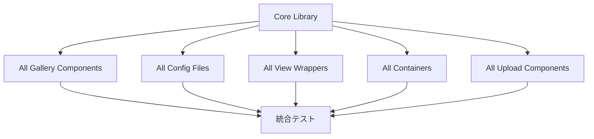

# Gallery-View ページネーション導入 - 完全修正対象リスト

**作成日**: 2025-08-25  
**目的**: Gallery-Viewページネーション導入に必要な全ファイルの修正対象を洗い出し  
**実行方針**: 技術負債回避のため全ファイルを一気に修正実行

## 🎯 修正対象ファイル一覧

### **一括修正対象ファイル（全20ファイル）**

#### **1. 共通ライブラリ（6ファイル）**
```
src/shared/view/gallery-view/
├── lib/
│   ├── usePaginatedGallery.ts           ★新規作成 - ページネーション管理フック
│   └── index.ts                         ★修正 - export追加
├── model/
│   └── types.ts                         ★修正 - GalleryPaginationConfig等追加
└── ui/
    ├── GalleryView.tsx                  ★修正 - ページネーション統合
    ├── GalleryPagination.tsx            ★新規作成 - UIコンポーネント
    └── index.ts                         ★修正 - export追加
```

#### **2. ギャラリー設定ファイル（4ファイル）**
```
src/page-components/
├── blueprint/home/lib/
│   └── blueprintGalleryConfig.tsx       ★修正 - pagination設定追加
├── project/basic-information/lib/
│   └── projectBlueprintGalleryConfig.tsx ★修正 - pagination設定追加  
├── project/quotation/lib/
│   └── quotationBlueprintGalleryConfig.tsx ★修正 - pagination設定追加
└── blueprint/similar/lib/
    └── similarBlueprintGalleryConfig.tsx ★修正 - pagination設定追加
```

**修正内容例**:
```typescript
export const createBlueprintGalleryConfig = (): GalleryViewConfig<Blueprint> => ({
  // ... 既存設定
  pagination: {                           // 新規追加
    enabled: true,
    defaultItemsPerPage: 20,
    allowedItemsPerPage: [10, 20, 50, 100],
    showItemsPerPageSelector: true,
    maxVisiblePages: 7,
  },
});
```

#### **3. ギャラリービューラッパー（3ファイル）**
```
src/page-components/
├── blueprint/home/ui/
│   └── BlueprintGalleryView.tsx         ★修正 - ページネーション対応
├── project/basic-information/ui/
│   └── BlueprintGallery.tsx            ★修正 - ページネーション対応
└── widgets/similar-blueprint-gallery/ui/
    └── SimilarBlueprintGallery.tsx     ★修正 - ページネーション対応
```

**修正内容例**:
```typescript
// 修正前
export function BlueprintGalleryView({ blueprints }: { blueprints: Blueprint[] }) {
  const config = createBlueprintGalleryConfig();
  return <GalleryView data={blueprints} config={config} />;
}

// 修正後 - 必要に応じてページネーション設定を動的に制御
export function BlueprintGalleryView({ 
  blueprints, 
  enablePagination = true 
}: { 
  blueprints: Blueprint[]; 
  enablePagination?: boolean;
}) {
  const config = {
    ...createBlueprintGalleryConfig(),
    pagination: { 
      ...createBlueprintGalleryConfig().pagination,
      enabled: enablePagination 
    }
  };
  return <GalleryView data={blueprints} config={config} />;
}
```

#### **4. メインコンテナ（3ファイル）**
```
src/page-components/
├── blueprint/home/ui/
│   └── BlueprintHomeContainer.tsx       ★修正 - メイン図面一覧
├── project/quotation/ui/
│   └── QuotationBlueprintInfoStep.tsx   ★修正 - 見積書図面
└── project/basic-information/ui/
    └── BasicInfoContainer.tsx           ★修正 - プロジェクト図面
```

#### **5. カスタムアップロードギャラリー（4ファイル）**
```
src/page-components/
├── blueprint/blueprint-upload/ui/
│   ├── UploadGalleryView.tsx            ★修正 - カスタム実装対応
│   └── BlueprintUploadContainer.tsx     ★修正 - 複雑な状態管理対応
└── project/blueprint-register/ui/
    ├── BlueprintUploadGallery.tsx       ★修正 - シンプル実装対応
    └── BlueprintRegisterContainer.tsx   ★修正 - 登録用コンテナ対応
```

**方針**: カスタム実装も含め全て一括対応し、一貫性のあるページネーション体験を提供

## 📋 修正の詳細内容

### **各ファイルタイプ別修正内容**

| ファイルタイプ | 修正内容 | 対応方針 | ファイル数 |
|---------------|---------|----------|-----------|
| **Core Library** | 新規作成・型定義追加・コンポーネント統合 | 🔴必須実装 | 6個 |
| **Gallery Config** | pagination設定オブジェクト追加 | 🔴必須実装 | 4個 |
| **View Wrapper** | config統合、props拡張 | 🔴必須実装 | 3個 |  
| **Container** | 状態管理とページネーション統合 | 🔴必須実装 | 3個 |
| **Custom Upload** | カスタム実装のページネーション対応 | 🔴必須実装 | 4個 |

### **一括修正戦略**

#### **1. 同時並行実装**


#### **2. 一括実装の利点**
- **技術負債回避**: 中途半端な状態を残さない
- **一貫性確保**: 全コンポーネントで統一されたページネーション体験
- **テスト効率**: 全機能を一度にテスト可能
- **リリース品質**: 完成された状態でのリリース

## 🎯 一括実装時の注意点

### **1. 後方互換性維持**
```typescript
// 既存機能への影響を回避
const displayData = config.pagination?.enabled ? currentData : data;
```

### **2. 設定の完全統一**
全20ファイルで同じページネーション設定値を使用:
```typescript
pagination: {
  enabled: true,                        // デフォルト有効
  defaultItemsPerPage: 20,              // テーブルと統一
  allowedItemsPerPage: [10, 20, 50, 100], // テーブルと統一
  showItemsPerPageSelector: true,       // セレクター表示
  maxVisiblePages: 7,                   // ページ番号表示数
}
```

### **3. カスタムコンポーネント対応**
アップロード系の特殊実装も標準ページネーションに統一:
```typescript
// カスタム実装でも標準的なページネーション体験を提供
const paginationConfig = config.pagination || { enabled: false };
const { currentData, ...paginationState } = usePaginatedGallery({
  data: customData,
  initialItemsPerPage: paginationConfig.defaultItemsPerPage || 20,
});
```

### **4. 一括実装のリスク管理**
- **段階的テスト**: コンポーネント種別ごとにテスト実行
- **ロールバック準備**: 問題発生時の即座復旧体制
- **型安全性**: TypeScriptエラー0件での完成を目標

## 📊 修正規模

### **新規作成**: 2ファイル
- `usePaginatedGallery.ts`
- `GalleryPagination.tsx`

### **修正**: 18ファイル
- Core: 4ファイル（types, GalleryView, index等）
- Config: 4ファイル（各ギャラリー設定）
- View: 3ファイル（ビューラッパー）
- Container: 3ファイル（コンテナ）
- Upload: 4ファイル（カスタム実装）

### **合計**: 20ファイル

## 🚀 一括実装計画

### **実行手順**
1. **事前準備**: 現在のコードのバックアップとブランチ作成
2. **Core Library実装**: 基盤となる6ファイルを完成
3. **全コンポーネント同時修正**: 残り14ファイルを一括修正
4. **全体統合テスト**: 20ファイル全ての動作確認
5. **TypeScript検証**: エラー0件での完成確認

### **成功基準**
- ✅ **全20ファイル修正完了**
- ✅ **TypeScriptエラー0件**  
- ✅ **既存機能の正常動作**
- ✅ **ページネーション機能の全画面での動作**
- ✅ **テーブルビューとの一貫性確保**

---

**実行方針**: 技術負債を残さないため、全20ファイルを一括で修正実行し、完全統一されたページネーション体験を一度に実現する。